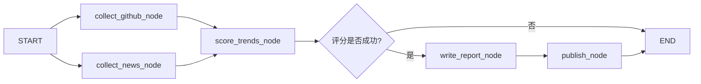

# 🤖 AI Trending

**每日 AI 开源项目与新闻聚合报告系统**

基于 LangGraph + CrewAI 构建的全自动 AI 日报生成流水线，每天自动发现 GitHub 热点 AI 项目、采集 AI 领域新闻，由 LLM 分析趋势并生成结构化日报，自动发布到 GitHub 和微信公众号。

[](https://www.python.org/)
[](https://github.com/langchain-ai/langgraph)
[](https://github.com/crewAIInc/crewAI)
[](./LICENSE)
[](https://github.com/features/actions)

[快速开始](#-快速开始) · [架构设计](#-架构设计) · [配置说明](#-配置说明) · [部署方式](#-部署方式) · [贡献指南](./CONTRIBUTING.md)


---

## ✨ 功能特性

- 🔍 **GitHub 热点发现** — 自动搜索 GitHub Trending，通过 AI 筛选最有价值的 AI 开源项目
- 📰 **多源新闻采集** — 聚合 Hacker News、Reddit、NewsData.io、知乎等多个渠道的 AI 新闻
- 🧠 **AI 趋势分析** — 由 LLM 对项目和新闻进行评分、排名，提炼技术趋势洞察
- 📝 **结构化日报生成** — 按规范格式自动生成 Markdown 日报，文风克制、信息密度高
- 📤 **多渠道自动发布** — 支持推送到 GitHub Issues/Pages 和微信公众号草稿箱
- ⏰ **定时自动运行** — 通过 GitHub Actions 每天定时执行，无需人工干预
- 📊 **运行指标追踪** — 记录每次运行的 Token 用量、耗时、成本估算
- 🔔 **Webhook 通知** — 支持企业微信、飞书、钉钉、Slack 机器人通知

## 📋 示例输出

```markdown
# 🤖 AI 日报 · 2026-03-25

> LLMOps 从可选变必选，端侧推理需求被持续低估

---

## 🔥 GitHub 热点项目

### 1. [omlx](https://github.com/apple/omlx) ⭐ 6777

**Apple Silicon 上最快的开源 LLM 推理框架**

- 🏷️ **类别**：推理框架
- 💻 **语言**：C++
- 📈 **趋势信号**：针对 Metal 后端重写推理内核，Llama 3 70B 吞吐量比 llama.cpp 高 40%

...
```

> 查看完整示例：[examples/optimized_daily_report_example.md](./examples/optimized_daily_report_example.md)

---

## 🏗️ 架构设计

```
┌─────────────────────────────────────────────────────┐
│  入口层  run.py                                      │
├─────────────────────────────────────────────────────┤
│  编排层  LangGraph (graph.py + nodes.py)             │
│          全局状态流转、并行采集、条件分支              │
├──────────────────────┬──────────────────────────────┤
│  Agent 层            │  Agent 层                    │
│  CrewAI              │  CrewAI                      │
│  github_trending/    │  new_collect/                │
│  (关键词→搜索→排名)   │  (多源抓取→LLM筛选)          │
├──────────────────────┴──────────────────────────────┤
│  工具层  tools/                                      │
│  github_trending_tool / ai_news_tool                │
│  wechat_publish_tool / github_publish_tool          │
├─────────────────────────────────────────────────────┤
│  基础设施  llm_client.py / logger.py / retry.py     │
│           config.py / metrics.py                    │
└─────────────────────────────────────────────────────┘
```

### 数据流



### 目录结构

```
ai_trending/
├── src/ai_trending/
│   ├── graph.py              # LangGraph 图定义
│   ├── nodes.py              # LangGraph 节点实现
│   ├── llm_client.py         # 统一 LLM 客户端（三档模型）
│   ├── config.py             # 配置加载
│   ├── crew/
│   │   ├── github_trending/  # GitHub 趋势分析 Crew
│   │   │   ├── keyword_planning/   # 子 Crew：关键词规划
│   │   │   └── trend_ranking/      # 子 Crew：趋势排名
│   │   ├── new_collect/      # 新闻采集 Crew
│   │   ├── report_writing/   # 日报撰写 Crew
│   │   ├── trend_scoring/    # 趋势评分 Crew
│   │   └── util/             # 共享工具（去重缓存等）
│   └── tools/                # 工具层
│       ├── github_trending_tool.py
│       ├── github_publish_tool.py
│       ├── wechat_publish_tool.py
│       └── ai_news_tool.py
├── tests/                    # 测试
├── reports/                  # 生成的日报（Markdown）
├── output/                   # 生成的微信 HTML
├── .github/workflows/        # GitHub Actions
├── Dockerfile
├── docker-compose.yml
└── run.py                    # 启动入口
```

---

## 🚀 快速开始

### 环境要求

- Python 3.10+
- [uv](https://github.com/astral-sh/uv)（推荐）或 pip
- OpenAI API Key（或兼容 API）
- GitHub Token（用于搜索和发布）

### 1. 克隆项目

```bash
git clone https://github.com/your-username/ai_trending.git
cd ai_trending
```

### 2. 安装依赖

```bash
# 使用 uv（推荐）
uv sync

# 或使用 pip
pip install -e .
```

### 3. 配置环境变量

```bash
cp .env.example .env
# 编辑 .env，填入必要的 API Key
```

最少需要配置以下变量：

```bash
# LLM（必填）
MODEL=openai/gpt-4o
OPENAI_API_KEY=sk-...

# GitHub（必填，用于搜索数据）
GITHUB_TRENDING_TOKEN=ghp_...
```

### 4. 运行

```bash
# 使用项目虚拟环境运行
.venv/bin/python run.py

# 或使用 uv
uv run python run.py

# 指定日期
.venv/bin/python run.py --date 2026-03-25

# 只校验配置，不执行
.venv/bin/python run.py --dry-run

# 详细日志
.venv/bin/python run.py --verbose
```

运行成功后，日报将保存到 `reports/YYYY-MM-DD.md`。

---

## ⚙️ 配置说明

完整配置项见 [.env.example](./.env.example)，以下是核心配置：

### LLM 配置

| 变量 | 说明 | 默认值 |
|------|------|--------|
| `MODEL` | 主力模型（内容分析、日报撰写） | `openai/gpt-4o` |
| `MODEL_LIGHT` | 轻量模型（数据采集、关键词规划） | `openai/gpt-4o-mini` |
| `MODEL_TOOL` | 工具调用模型（纯工具路由） | 回退到 `MODEL_LIGHT` |
| `OPENAI_API_KEY` | API Key | — |
| `OPENAI_API_BASE` | 自定义 API Base（代理/第三方） | OpenAI 官方 |
| `LLM_TEMPERATURE` | 生成温度 | `0.1` |

> 支持 LiteLLM 格式，可切换到 DeepSeek、Moonshot、Anthropic 等任意兼容服务，只需修改 `.env`，无需改代码。

**切换到 DeepSeek 示例：**
```bash
OPENAI_API_BASE=https://api.deepseek.com/v1
OPENAI_API_KEY=sk-deepseek-...
MODEL=deepseek/deepseek-chat
MODEL_LIGHT=deepseek/deepseek-chat
```

### GitHub 配置

| 变量 | 说明 |
|------|------|
| `GITHUB_TRENDING_TOKEN` | GitHub Token，需要 `public_repo` 权限 |
| `GITHUB_REPORT_REPO` | 报告推送目标仓库（`owner/repo`） |

### 新闻源配置（可选）

| 变量 | 说明 |
|------|------|
| `NEWSDATA_API_KEY` | [newsdata.io](https://newsdata.io) API Key，扩展新闻源 |
| `ZHIHU_COOKIE` | 知乎 Cookie，用于获取知乎热榜 AI 内容 |

### 微信公众号配置（可选）

| 变量 | 说明 |
|------|------|
| `WECHAT_APP_ID` | 微信公众号 AppID |
| `WECHAT_APP_SECRET` | 微信公众号 AppSecret |
| `WECHAT_THUMB_MEDIA_ID` | 封面图 media_id（需提前上传） |

### 通知配置（可选）

支持企业微信、飞书、钉钉、Slack 机器人通知：

```bash
# 任选其一
WEBHOOK_URL=https://qyapi.weixin.qq.com/cgi-bin/webhook/send?key=xxx  # 企业微信
WEBHOOK_URL=https://open.feishu.cn/open-apis/bot/v2/hook/xxx           # 飞书
WEBHOOK_URL=https://oapi.dingtalk.com/robot/send?access_token=xxx      # 钉钉
WEBHOOK_URL=https://hooks.slack.com/services/xxx/xxx/xxx               # Slack
```

---

## 🚢 部署方式

### 方式一：GitHub Actions（推荐）

Fork 本仓库，在 Settings → Secrets 中配置以下 Secrets：

| Secret | 说明 |
|--------|------|
| `OPENAI_API_KEY` | LLM API Key |
| `GITHUB_TRENDING_TOKEN` | GitHub Token |
| `MODEL` | 主力模型名称（可选） |
| `NEWSDATA_API_KEY` | 新闻 API Key（可选） |
| `WECHAT_APP_ID` | 微信 AppID（可选） |
| `WECHAT_APP_SECRET` | 微信 AppSecret（可选） |
| `WEBHOOK_URL` | 通知 Webhook（可选） |

配置完成后，每天 UTC 00:00（北京时间 08:00）自动运行，生成的日报会自动 commit 到仓库。

也可以在 Actions 页面手动触发，支持指定日期参数。

### 方式二：Docker

```bash
# 构建镜像
docker build -t ai-trending .

# 手动运行一次
docker run --rm --env-file .env \
  -v $(pwd)/reports:/app/reports \
  -v $(pwd)/output:/app/output \
  ai-trending

# 指定日期
docker run --rm --env-file .env \
  -v $(pwd)/reports:/app/reports \
  ai-trending --date 2026-03-25
```

### 方式三：Docker Compose

```bash
# 手动运行一次
docker compose run --rm ai-trending

# 启动定时调度（每天早 8 点自动执行）
docker compose up -d ai-trending-cron

# 查看日志
docker compose logs -f ai-trending-cron
```

### 方式四：本地定时任务（cron）

```bash
# 编辑 crontab
crontab -e

# 每天 08:00 运行（根据实际路径修改）
0 8 * * * cd /path/to/ai_trending && .venv/bin/python run.py >> logs/cron.log 2>&1
```

---

## 🧪 开发与测试

### 运行测试

```bash
# 运行所有单元测试
.venv/bin/python -m pytest tests/unit/ -v

# 运行指定模块测试
.venv/bin/python -m pytest tests/test_github_trending_tool.py -v

# 查看覆盖率报告
.venv/bin/python -m pytest tests/unit/ --cov=src/ai_trending --cov-report=term-missing

# 运行集成测试（需真实 API Key）
RUN_INTEGRATION_TESTS=1 .venv/bin/python -m pytest tests/integration/ -v
```

### 代码质量

```bash
# 格式化
.venv/bin/python -m black src/ tests/

# Lint
.venv/bin/python -m ruff check src/ tests/

# 类型检查
.venv/bin/python -m mypy src/
```

### 开发调试

```bash
# 只校验配置
.venv/bin/python run.py --dry-run

# 详细日志模式
.venv/bin/python run.py --verbose

# 指定历史日期（用于调试）
.venv/bin/python run.py --date 2026-03-17
```

---

## 🔧 扩展开发

### 新增新闻数据源

在 `src/ai_trending/crew/new_collect/fetchers.py` 中添加新的 Fetcher 方法：

```python
def _fetch_my_source(self, keywords: list[str], top_n: int) -> list[dict]:
    """从自定义数据源抓取新闻。"""
    resp = safe_request("GET", "https://api.example.com/news", params={...})
    if resp is None:
        return []
    # 返回标准格式
    return [{
        "title": item["title"],
        "url": item["url"],
        "score": item.get("score", 0),
        "source": "My Source",
        "summary": item.get("description", ""),
        "time": item.get("published_at", ""),
    } for item in resp.json().get("articles", [])]
```

### 新增发布渠道

在 `src/ai_trending/tools/` 下创建新的发布 Tool：

```python
# tools/dingtalk_publish_tool.py
class DingtalkPublishTool(BaseTool):
    name: str = "dingtalk_publish"
    description: str = "将已生成的 AI 日报发布到钉钉群。"

    def _run(self, content: str, title: str = "", date_str: str = "") -> str:
        # 实现钉钉 Webhook 发布逻辑
        ...
```

然后在 `nodes.py` 的 `_get_enabled_publish_tools()` 中注册。

---

## 📊 运行指标

每次运行后，指标数据保存到 `metrics/` 目录，包含：

- 运行状态（成功/失败/取消）
- 各阶段耗时
- Token 用量（prompt / completion / total）
- 估算费用
- 错误信息

---

## 🤝 贡献

欢迎提交 Issue 和 Pull Request！详见 [CONTRIBUTING.md](./CONTRIBUTING.md)。

**贡献方向：**
- 新增新闻数据源（Reddit、Twitter/X、微博等）
- 新增发布渠道（钉钉、飞书、邮件、Telegram 等）
- 改进日报内容质量（Prompt 优化）
- 支持更多 LLM 提供商
- 性能优化（并发采集、缓存策略）

---

## 📄 许可证

本项目基于 [MIT License](./LICENSE) 开源。

---

## 🙏 致谢

本项目基于以下优秀开源项目构建：

- [LangGraph](https://github.com/langchain-ai/langgraph) — 状态机编排框架
- [CrewAI](https://github.com/crewAIInc/crewAI) — 多 Agent 协作框架
- [LiteLLM](https://github.com/BerriAI/litellm) — 统一 LLM API 接口
- [uv](https://github.com/astral-sh/uv) — 极速 Python 包管理器