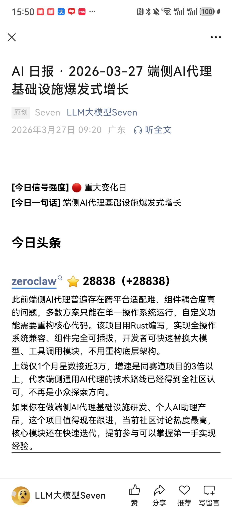
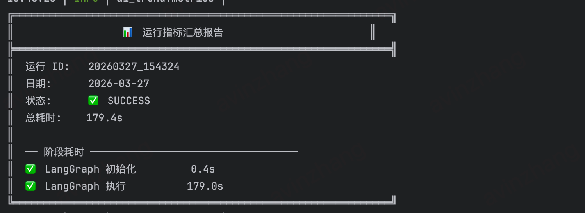
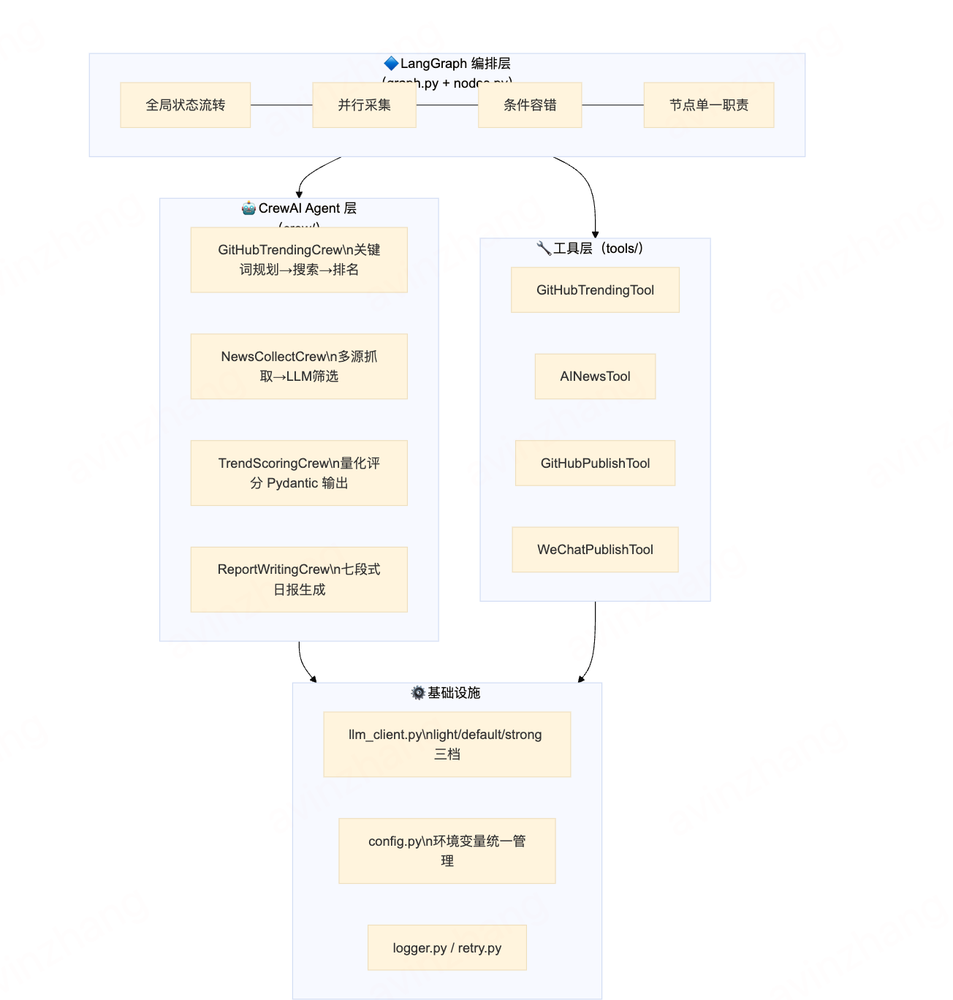
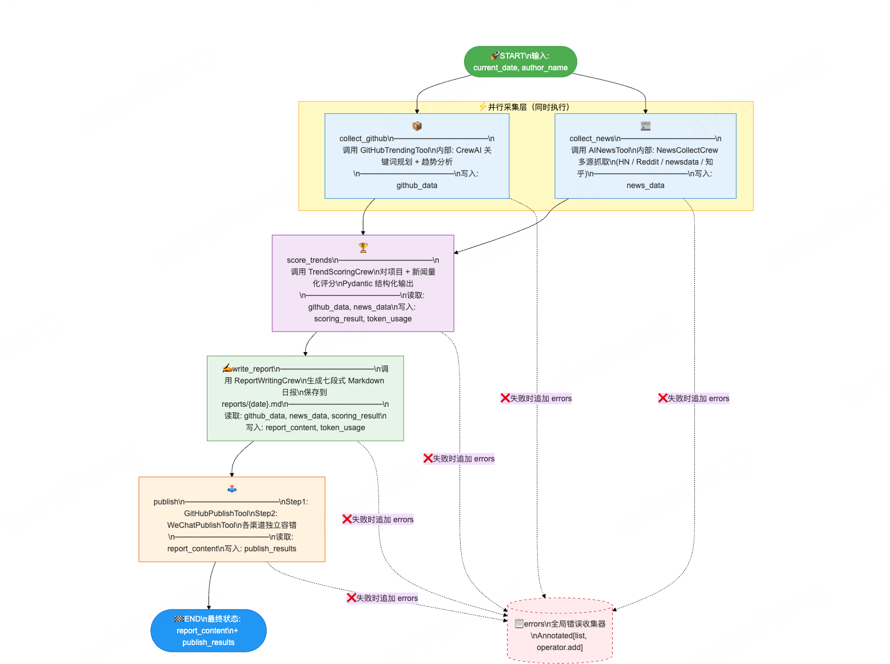
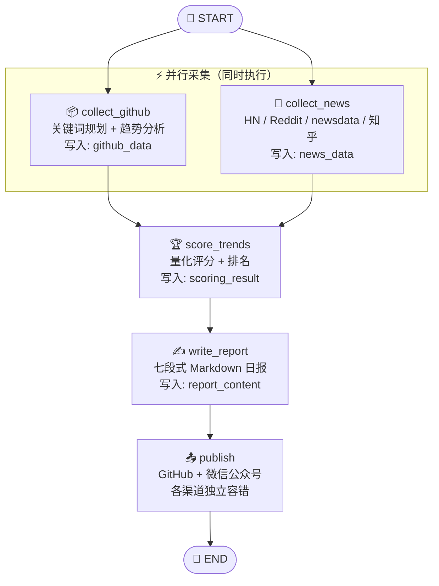
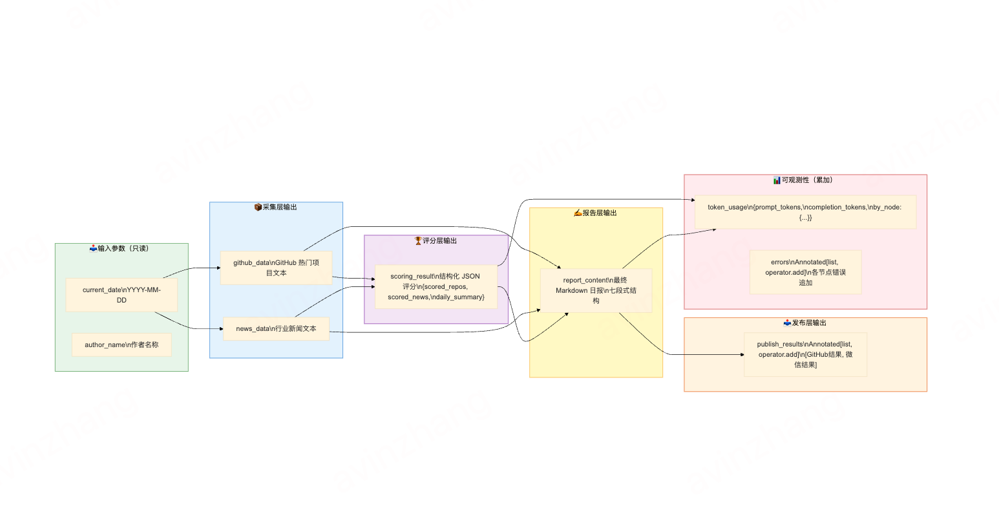

<div align="center">

# 🤖 AI Trending

**每天早 8 点，自动给你推送一份有观点的 AI 日报**

基于 **LangGraph + CrewAI** 构建的全自动 AI 日报生成流水线  
自动发现 GitHub 热点项目 · 采集多源 AI 新闻 · LLM 分析趋势 · 自动发布

[](https://www.python.org/)
[](https://github.com/langchain-ai/langgraph)
[](https://github.com/crewAIInc/crewAI)
[](./LICENSE)
[](https://github.com/features/actions)
[](https://github.com/qwzhang01/ai_trending)

🟢 **已上线运行** · 微信公众号「LLM大模型Seven」每日自动推送

[**快速开始**](#-快速开始) · [**架构设计**](#-架构设计) · [**配置说明**](#-配置说明) · [**部署方式**](#-部署方式)

</div>

---

## 📱 真实运行效果

> 以下均为系统自动生成，无人工干预

<table>
  <tr>
    <!-- 左：手机截图，控制宽度让高度和右边匹配 -->
    <td align="center" valign="top" width="38%">
      
      <br/><sub><b>📱 微信公众号文章</b></sub>
    </td>
    <!-- 右：两张叠放 -->
    <td align="center" valign="top" width="62%">
      
      <br/><sub><b>⚡ 终端运行输出</b></sub>
      <br/><br/>
      
      <br/><sub><b>🔔 微信消息推送</b></sub>
    </td>
  </tr>
</table>

<p align="center">
  <b>📲 扫码订阅每日 AI 日报</b><br/>
  
</p>

---

## ✨ 这个项目能做什么

| 功能 | 说明 |
|------|------|
| 🔍 **GitHub 热点发现** | 自动搜索 GitHub，AI 筛选最有价值的 AI 开源项目，不是简单爬 Trending 页 |
| 📰 **多源新闻聚合** | Hacker News · Reddit · NewsData.io · 知乎，多渠道并发抓取 + LLM 去噪筛选 |
| 🧠 **AI 趋势分析** | LLM 对项目和新闻量化评分、排名，提炼真正有价值的技术趋势洞察 |
| 📝 **结构化日报生成** | 七段式 Markdown 日报，文风克制、信息密度高，有观点不灌水 |
| 📤 **多渠道自动发布** | GitHub Issues/Pages + 微信公众号草稿箱，各渠道独立容错 |
| ⏰ **定时全自动运行** | GitHub Actions 每天定时执行，零人工干预 |
| 📊 **运行指标追踪** | Token 用量、耗时、成本估算，每次运行都有记录 |
| 🔔 **Webhook 通知** | 企业微信 · 飞书 · 钉钉 · Slack，运行完成自动通知 |

---

## 📋 日报示例

```markdown
# 🤖 AI 日报 · 2026-03-25

**[今日信号强度]** 🟡 常规更新日

> **[今日一句话]** LLMOps 从可选变必选，端侧推理需求被持续低估

---

## 🎯 今日头条

**omlx — 让 Mac 跑大模型终于不再是「能用就行」** ⭐ 6777（+1840）

一个月前还没人听过这个名字，现在它是 Apple Silicon 上跑 LLM 最快的开源方案。
针对 Metal 后端重写了推理内核，实测 Llama 3 70B 的吞吐量比 llama.cpp 高出 40%。
增速是同赛道项目的 2 倍——端侧推理的需求显然被低估了。

---

## 🔥 GitHub 热点项目

### 1. omlx ⭐ 6777（+1840）  推理框架
### 2. bisheng ⭐ 15432（+1200）  Agent 框架
### 3. CLI-Anything ⭐ 5210（+890）  开发工具

## 📰 AI 热点新闻（含可信度标签 + So What 分析）

## 🧭 趋势洞察（含数据支撑 + 前瞻预判）

## 💡 本周行动建议（可落地任务 + 时效理由）

## 📊 上期回顾（星数追踪 + 趋势验证）
```

> 查看完整示例：[examples/optimized_daily_report_example.md](./examples/optimized_daily_report_example.md)

---

## 🏗️ 架构设计

### 整体分层架构

<div align="center">
  
</div>

```
┌─────────────────────────────────────────────────────┐
│  入口层  run.py                                      │
├─────────────────────────────────────────────────────┤
│  编排层  LangGraph (graph.py + nodes.py)             │
│          全局状态流转、并行采集、条件分支              │
├──────────────────────┬──────────────────────────────┤
│  Agent 层 — CrewAI   │  Agent 层 — CrewAI           │
│  github_trending/    │  new_collect/                │
│  关键词→搜索→排名     │  多源抓取→LLM筛选            │
│  trend_scoring/      │  report_writing/             │
│  量化评分             │  七段式日报撰写               │
├──────────────────────┴──────────────────────────────┤
│  工具层  tools/                                      │
│  github_trending_tool · ai_news_tool                │
│  wechat_publish_tool · github_publish_tool          │
├─────────────────────────────────────────────────────┤
│  基础设施  llm_client.py / logger.py / retry.py     │
│           config.py / metrics.py                    │
└─────────────────────────────────────────────────────┘
```

### LangGraph 状态机流程

<div align="center">
  
</div>



### 状态字段流转

<div align="center">
  
</div>

### 目录结构

```
ai_trending/
├── src/ai_trending/
│   ├── graph.py              # LangGraph 图定义
│   ├── nodes.py              # LangGraph 节点实现
│   ├── llm_client.py         # 统一 LLM 客户端（light/default/strong 三档）
│   ├── config.py             # 配置加载
│   ├── crew/
│   │   ├── github_trending/  # GitHub 趋势分析 Crew
│   │   │   ├── keyword_planning/   # 子 Crew：关键词规划
│   │   │   └── trend_ranking/      # 子 Crew：趋势排名
│   │   ├── new_collect/      # 新闻采集 Crew（多源并发）
│   │   ├── trend_scoring/    # 趋势评分 Crew
│   │   └── report_writing/   # 日报撰写 Crew（七段式）
│   └── tools/                # 工具层
│       ├── github_trending_tool.py
│       ├── github_publish_tool.py
│       ├── wechat_publish_tool.py
│       └── ai_news_tool.py
├── tests/                    # 单元测试 + 集成测试
├── reports/                  # 生成的日报（Markdown）
├── output/                   # 生成的微信 HTML
├── .github/workflows/        # GitHub Actions 定时任务
├── Dockerfile
├── docker-compose.yml
└── run.py                    # 启动入口
```

---

## 🚀 快速开始

### 环境要求

- Python 3.10+
- OpenAI API Key（或任意兼容 API）
- GitHub Token（用于搜索和发布）

### 1. 克隆 & 安装

```bash
git clone https://github.com/qwzhang01/ai_trending.git
cd ai_trending

# 使用 uv（推荐，极速）
uv sync

# 或使用 pip
pip install -e .
```

### 2. 配置环境变量

```bash
cp .env.example .env
```

最少只需配置 2 个变量就能跑起来：

```bash
# LLM（必填）
MODEL=openai/gpt-4o
OPENAI_API_KEY=sk-...

# GitHub（必填，用于搜索数据）
GITHUB_TRENDING_TOKEN=ghp_...
```

### 3. 运行

```bash
# 立即生成今日日报
.venv/bin/python run.py

# 指定历史日期
.venv/bin/python run.py --date 2026-03-25

# 只校验配置，不执行
.venv/bin/python run.py --dry-run

# 详细日志
.venv/bin/python run.py --verbose
```

运行成功后，日报保存到 `reports/YYYY-MM-DD.md`，终端输出指标汇总。

---

## ⚙️ 配置说明

完整配置项见 [.env.example](./.env.example)。

### LLM 配置

| 变量 | 说明 | 默认值 |
|------|------|--------|
| `MODEL` | 主力模型（内容分析、日报撰写） | `openai/gpt-4o` |
| `MODEL_LIGHT` | 轻量模型（数据采集、关键词规划） | `openai/gpt-4o-mini` |
| `OPENAI_API_KEY` | API Key | — |
| `OPENAI_API_BASE` | 自定义 API Base（代理/第三方） | OpenAI 官方 |
| `LLM_TEMPERATURE` | 生成温度 | `0.1` |

> 支持 LiteLLM 格式，可一键切换到 DeepSeek、Moonshot、Anthropic 等，**只改 `.env`，不改代码**。

**切换到 DeepSeek（更便宜）：**
```bash
OPENAI_API_BASE=https://api.deepseek.com/v1
OPENAI_API_KEY=sk-deepseek-...
MODEL=deepseek/deepseek-chat
MODEL_LIGHT=deepseek/deepseek-chat
```

### GitHub 配置

| 变量 | 说明 |
|------|------|
| `GITHUB_TRENDING_TOKEN` | GitHub Token，需要 `public_repo` 权限 |
| `GITHUB_REPORT_REPO` | 报告推送目标仓库（`owner/repo`） |

### 新闻源配置（可选）

| 变量 | 说明 |
|------|------|
| `NEWSDATA_API_KEY` | [newsdata.io](https://newsdata.io) API Key，扩展新闻源 |
| `ZHIHU_COOKIE` | 知乎 Cookie，获取知乎热榜 AI 内容 |

### 微信公众号配置（可选）

| 变量 | 说明 |
|------|------|
| `WECHAT_APP_ID` | 微信公众号 AppID |
| `WECHAT_APP_SECRET` | 微信公众号 AppSecret |
| `WECHAT_THUMB_MEDIA_ID` | 封面图 media_id（需提前上传） |

### 通知配置（可选）

支持企业微信、飞书、钉钉、Slack：

```bash
WEBHOOK_URL=https://qyapi.weixin.qq.com/cgi-bin/webhook/send?key=xxx  # 企业微信
WEBHOOK_URL=https://open.feishu.cn/open-apis/bot/v2/hook/xxx           # 飞书
WEBHOOK_URL=https://oapi.dingtalk.com/robot/send?access_token=xxx      # 钉钉
WEBHOOK_URL=https://hooks.slack.com/services/xxx/xxx/xxx               # Slack
```

---

## 🚢 部署方式

### 方式一：GitHub Actions（推荐，零成本）

Fork 本仓库，在 **Settings → Secrets** 中配置以下 Secrets：

| Secret | 说明 |
|--------|------|
| `OPENAI_API_KEY` | LLM API Key |
| `GITHUB_TRENDING_TOKEN` | GitHub Token |
| `MODEL` | 主力模型名称（可选） |
| `NEWSDATA_API_KEY` | 新闻 API Key（可选） |
| `WECHAT_APP_ID` | 微信 AppID（可选） |
| `WECHAT_APP_SECRET` | 微信 AppSecret（可选） |
| `WEBHOOK_URL` | 通知 Webhook（可选） |

配置完成后，每天 **UTC 00:00（北京时间 08:00）** 自动运行，生成的日报自动 commit 到仓库。也可在 Actions 页面手动触发，支持指定日期。

### 方式二：Docker

```bash
# 构建镜像
docker build -t ai-trending .

# 运行一次
docker run --rm --env-file .env \
  -v $(pwd)/reports:/app/reports \
  ai-trending

# 指定日期
docker run --rm --env-file .env \
  -v $(pwd)/reports:/app/reports \
  ai-trending --date 2026-03-25
```

### 方式三：Docker Compose

```bash
# 手动运行一次
docker compose run --rm ai-trending

# 启动定时调度（每天早 8 点自动执行）
docker compose up -d ai-trending-cron

# 查看日志
docker compose logs -f ai-trending-cron
```

### 方式四：本地 cron

```bash
# 每天 08:00 运行
0 8 * * * cd /path/to/ai_trending && .venv/bin/python run.py >> logs/cron.log 2>&1
```

---

## 🧪 开发与测试

```bash
# 运行所有单元测试
.venv/bin/python -m pytest tests/unit/ -v

# 查看覆盖率
.venv/bin/python -m pytest tests/unit/ --cov=src/ai_trending --cov-report=term-missing

# 运行集成测试（需真实 API Key）
RUN_INTEGRATION_TESTS=1 .venv/bin/python -m pytest tests/integration/ -v

# 代码格式化
.venv/bin/python -m black src/ tests/

# Lint
.venv/bin/python -m ruff check src/ tests/
```

---

## 🔧 扩展开发

### 新增新闻数据源

在 `src/ai_trending/crew/new_collect/fetchers.py` 中添加新的 Fetcher 方法：

```python

def _fetch_my_source(self, keywords: list[str], top_n: int) -> list[dict]:
    """从自定义数据源抓取新闻。"""
    resp = safe_request("GET", "https://api.example.com/news", params={...})
    if resp is None:
        return []
    return [{
        "title": item["title"],
        "url": item["url"],
        "score": item.get("score", 0),
        "source": "My Source",
        "summary": item.get("description", ""),
        "time": item.get("published_at", ""),
    } for item in resp.json().get("articles", [])]

```

### 新增发布渠道

在 `src/ai_trending/tools/` 下创建新的发布 Tool：

```python
# tools/dingtalk_publish_tool.py
class DingtalkPublishTool(BaseTool):
    name: str = "dingtalk_publish"
    description: str = "将已生成的 AI 日报发布到钉钉群。"

    def _run(self, content: str, title: str = "", date_str: str = "") -> str:
        # 实现钉钉 Webhook 发布逻辑
        ...
```

然后在 `nodes.py` 的 `_get_enabled_publish_tools()` 中注册。

---

## 📊 运行指标

每次运行后，指标数据保存到 `metrics/` 目录：

- ✅ 运行状态（成功/失败/取消）
- ⏱️ 各阶段耗时
- 🪙 Token 用量（prompt / completion / total）
- 💰 估算费用
- ❌ 错误信息

---

## 🤝 贡献

欢迎提交 Issue 和 Pull Request！详见 [CONTRIBUTING.md](./CONTRIBUTING.md)。

**欢迎贡献的方向：**

- 📡 新增新闻数据源（Twitter/X、微博、Medium 等）
- 📤 新增发布渠道（钉钉、飞书、邮件、Telegram 等）
- 🧠 改进日报内容质量（Prompt 优化）
- 🔌 支持更多 LLM 提供商
- ⚡ 性能优化（并发采集、缓存策略）

---

## 📄 许可证

本项目基于 [MIT License](./LICENSE) 开源。

---

## 📈 Star History

[](https://star-history.com/#qwzhang01/ai_trending&Date)

---

## 🙏 致谢

本项目基于以下优秀开源项目构建：

- [LangGraph](https://github.com/langchain-ai/langgraph) — 状态机编排框架
- [CrewAI](https://github.com/crewAIInc/crewAI) — 多 Agent 协作框架
- [LiteLLM](https://github.com/BerriAI/litellm) — 统一 LLM API 接口
- [uv](https://github.com/astral-sh/uv) — 极速 Python 包管理器

---
