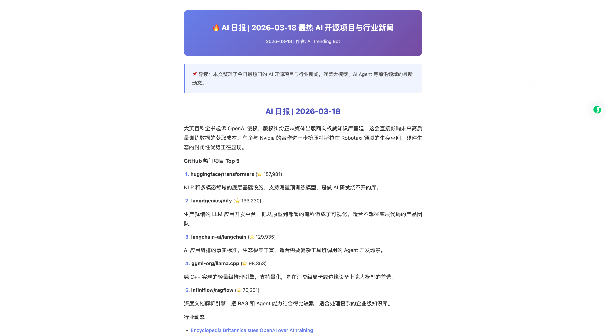

# 🔥 AI Trending — 每日 AI 开源项目与新闻聚合报告

基于 [CrewAI](https://www.crewai.com/) 多 Agent 协作框架，每天自动抓取 GitHub 热门 AI 开源项目和行业新闻，生成结构化报告，并推送到 GitHub 和微信公众号。



## ✨ 功能特性

- 🔍 **GitHub 热门项目追踪** — 通过 GitHub API 搜索当天最热的 AI/LLM/Agent 开源项目 Top 5
- 📰 **AI 新闻聚合** — 从 Hacker News、Reddit、newsdata.io 等多源抓取最新 AI 行业新闻
- 📝 **智能报告生成** — 多 Agent 协作，将数据整合为结构清晰的 Markdown 日报
- 🚀 **GitHub 自动发布** — 通过 GitHub API 将报告推送到指定仓库
- 📱 **微信公众号文章** — 自动生成适配微信排版的 HTML 文章

## 🏗️ 架构设计

```
┌─────────────────────────────────────────────────────┐
│                   AI Trending Crew                   │
├──────────────┬──────────────┬────────────┬───────────┤
│  GitHub      │  AI 新闻     │  报告撰写   │  发布     │
│  趋势研究员   │  分析师      │  专家       │  专员     │
├──────────────┼──────────────┼────────────┼───────────┤
│ GitHub       │ Hacker News  │  (无工具)   │ GitHub    │
│ Trending     │ Reddit       │  整合上游    │ Publish   │
│ Tool         │ newsdata.io  │  输出       │ Tool +    │
│              │              │            │ WeChat    │
│              │              │            │ Tool      │
└──────┬───────┴──────┬───────┴─────┬──────┴─────┬─────┘
       │              │             │            │
       ▼              ▼             ▼            ▼
  [GitHub 项目]  [AI 新闻]  → [Markdown 报告] → [GitHub + 微信]
```

**任务流水线（顺序执行）：**
1. `github_trending_task` — GitHub 趋势研究员抓取热门 AI 项目
2. `ai_news_task` — AI 新闻分析师搜集行业动态
3. `report_writing_task` — 报告撰写专家整合两个任务的输出，生成完整报告
4. `github_publish_task` — 发布专员将报告推送到 GitHub
5. `wechat_article_task` — 发布专员生成微信公众号 HTML 文章

## 🚀 快速开始

### 1. 安装依赖

确保已安装 Python 3.10+ 和 [uv](https://docs.astral.sh/uv/)：

```bash
uv sync
```

### 2. 配置环境变量

```bash
cp .env.example .env
```

编辑 `.env` 文件：

| 变量 | 必需 | 说明 |
|------|------|------|
| `MODEL` | ✅ | LLM 模型，如 `ollama/llama3.1`、`openai/gpt-4o` |
| `API_BASE` | 视情况 | 本地模型需要，如 Ollama 的 `http://localhost:11434` |
| `GITHUB_TOKEN` | 推荐 | GitHub API Token（提升 API 速率 + 发布报告） |
| `GITHUB_REPORT_REPO` | 可选 | 报告推送目标仓库，格式 `owner/repo` |
| `NEWSDATA_API_KEY` | 可选 | newsdata.io 的 API Key，用于更多新闻来源 |

### 3. 运行

```bash
crewai run
```

### 输出

- `reports/YYYY-MM-DD.md` — Markdown 格式的每日报告
- `output/wechat_YYYY-MM-DD.html` — 微信公众号文章（HTML）
- GitHub 仓库 `reports/` 目录 — 自动推送（需配置 Token）

## 🛠️ 自定义工具

| 工具 | 文件 | 说明 |
|------|------|------|
| `GitHubTrendingTool` | `tools/github_trending_tool.py` | GitHub API 搜索热门 AI 项目 |
| `AINewsTool` | `tools/ai_news_tool.py` | 多源 AI 新闻聚合 |
| `GitHubPublishTool` | `tools/github_publish_tool.py` | 报告推送到 GitHub |
| `WeChatArticleTool` | `tools/wechat_article_tool.py` | 生成微信公众号 HTML |

## 📂 项目结构

```
ai_trending/
├── src/ai_trending/
│   ├── config/
│   │   ├── agents.yaml        # Agent 定义
│   │   └── tasks.yaml         # Task 定义
│   ├── tools/
│   │   ├── github_trending_tool.py
│   │   ├── ai_news_tool.py
│   │   ├── github_publish_tool.py
│   │   └── wechat_article_tool.py
│   ├── crew.py                # Crew 编排
│   └── main.py                # 入口
├── reports/                   # 生成的 Markdown 报告
├── output/                    # 生成的微信文章
├── knowledge/                 # 知识库
├── .env                       # 环境变量
└── pyproject.toml
```

## 📋 其他命令

```bash
# 训练 Crew
crewai train -n 5 -f training.json

# 测试执行效果
crewai test -n 3 -m gpt-4o-mini

# 重放指定任务
crewai replay -t <task_id>
```
