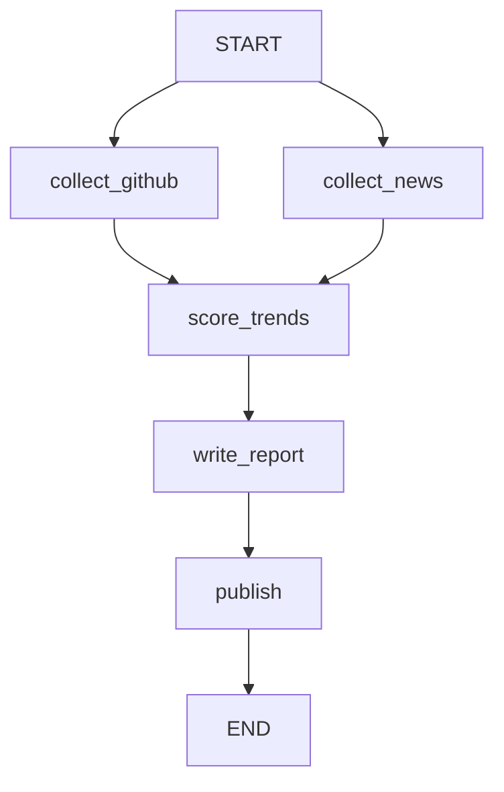

# AI Trending 详细文档

## 目录

- [架构设计](#架构设计)
- [配置详解](#配置详解)
- [API 参考](#api-参考)
- [扩展开发](#扩展开发)
- [故障排除](#故障排除)

## 架构设计

### 状态机设计

AI Trending 使用 LangGraph StateGraph 实现显式状态流转：



### 数据流

1. **并行采集**：GitHub 项目和新闻同时抓取
2. **结构化评分**：LLM 对内容进行多维度评分
3. **报告生成**：基于评分结果生成 Markdown 报告
4. **多渠道发布**：推送到 GitHub、微信公众号等平台

## 配置详解

### 环境变量优先级

配置按以下优先级加载：

1. `.env.local` (本地开发)
2. `.env` (生产环境)
3. 系统环境变量
4. 默认值

### 高级配置示例

```bash
# 多模型策略
MODEL=openai/gpt-4o
MODEL_LIGHT=openai/gpt-4o-mini
MODEL_TOOL=openai/gpt-4o-mini

# 高级 LLM 参数
LLM_TEMPERATURE=0.1
LLM_MAX_TOKENS=4096
LLM_TOP_P=0.95
LLM_FREQUENCY_PENALTY=0.0
LLM_PRESENCE_PENALTY=0.0

# 重试策略
MAX_RETRIES=3
REQUEST_TIMEOUT=30
RETRY_BACKOFF=1.5

# 缓存配置
DEDUP_CACHE_TTL=86400  # 24小时
MAX_CACHE_SIZE=1000

# 性能调优
CONCURRENT_WORKERS=3
BATCH_SIZE=5
```

## API 参考

### 核心模块

#### config.py

```python
from ai_trending.config import load_config, validate_config

# 加载配置
config = load_config()

# 验证配置
validate_config(config)
```

#### graph.py

```python
from ai_trending.graph import get_graph

# 获取状态图
graph = get_graph()

# 执行状态机
initial_state = {
    "current_date": "2025-03-19",
    "author_name": "AI Bot",
}
final_state = graph.invoke(initial_state)
```

#### llm_client.py

```python
from ai_trending.llm_client import LLMClient

# 创建客户端
client = LLMClient()

# 调用模型
response = client.chat_completion(
    messages=[{"role": "user", "content": "Hello"}],
    model="openai/gpt-4o",
    temperature=0.1
)
```

### 工具模块

#### GitHub 趋势工具

```python
from ai_trending.tools.github_trending_tool import GitHubTrendingTool

tool = GitHubTrendingTool()
result = tool._run(query="AI", top_n=5)
```

#### AI 新闻工具

```python
from ai_trending.tools.ai_news_tool import AINewsTool

tool = AINewsTool()
result = tool._run(sources=["hackernews", "reddit"])
```

## 扩展开发

### 添加新的数据源

1. 在 `src/ai_trending/tools/` 下创建新工具
2. 实现 `_run` 方法
3. 在 `nodes.py` 中集成到状态图

### 自定义评分规则

修改 `score_trends` 节点中的评分提示词：

```python
# 在 nodes.py 中修改评分逻辑
scoring_prompt = """
请从以下维度评分：
- 技术前沿性 (1-10)
- 社区活跃度 (1-10) 
- 商业价值 (1-10)
- 学习价值 (1-10)
"""
```

### 添加发布渠道

1. 在 `src/ai_trending/tools/` 下创建发布工具
2. 实现 `_run` 方法
3. 在 `publish` 节点中集成

## 故障排除

### 常见问题

#### LLM API 连接失败

- 检查 API Key 是否正确
- 验证 API Base URL 是否可访问
- 检查网络连接和防火墙设置

#### GitHub API 速率限制

- 配置 `GITHUB_TOKEN` 提高速率限制
- 减少并发请求数量
- 启用去重缓存减少重复请求

#### 内存使用过高

- 减少 `CONCURRENT_WORKERS` 数量
- 降低 `BATCH_SIZE`
- 启用轻量模型 `MODEL_LIGHT`

### 日志调试

```bash
# 启用详细日志
export CREW_VERBOSE=true
python run.py --verbose

# 查看详细错误信息
export PYTHONFAULTHANDLER=1
```

### 性能优化

1. **启用缓存**：配置去重缓存减少重复请求
2. **模型分级**：轻量任务使用低成本模型
3. **并发控制**：调整工作线程数量避免资源竞争
4. **批量处理**：合理设置批处理大小提高效率