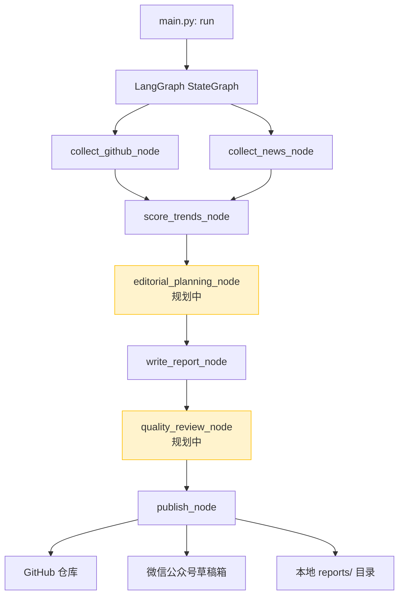
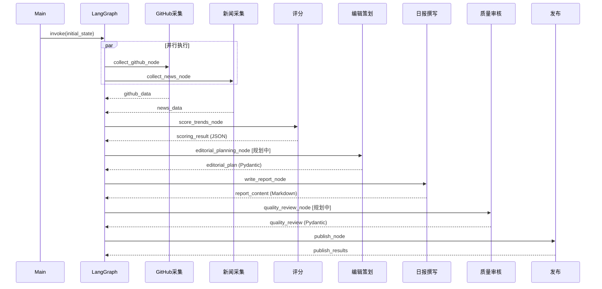
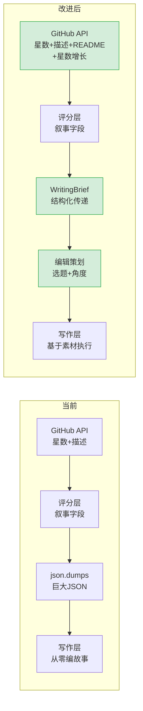
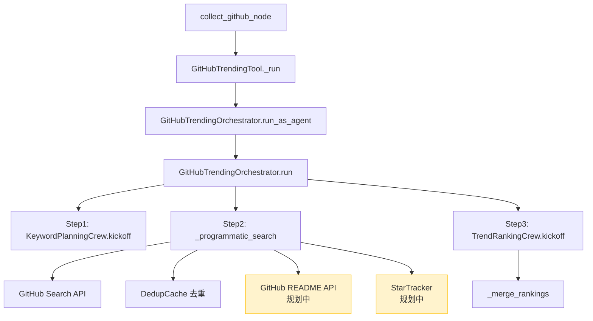
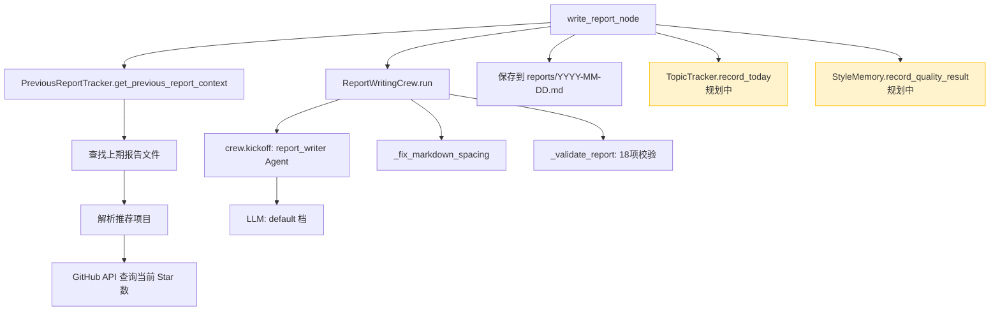
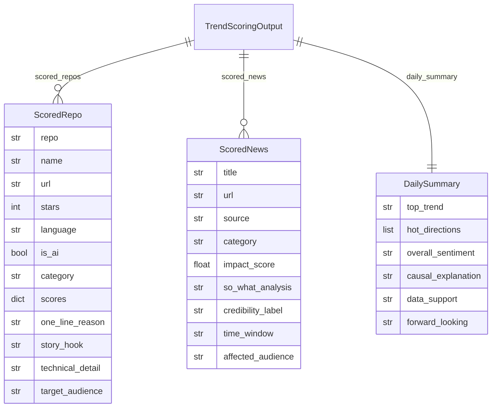

# AI Trending — 需求文档

---

## 1. 项目概览

### 1.1 系统定位

**AI Trending** 是一个 **AI Agent 驱动的 AI 日报自动生成系统**，核心目标：

1. 自动发现 GitHub 热点 AI 开源项目（CrewAI 关键词规划 + GitHub Search API）
2. 自动采集 AI 领域热点新闻（多源并发抓取：HN / Reddit / newsdata.io / 知乎）
3. 由 LLM 对数据进行结构化评分（TrendScoringCrew）
4. `[规划中]` 由编辑策划 Agent 做选题决策（EditorialPlanningCrew）
5. 由 LLM 生成七段式 Markdown 日报（ReportWritingCrew）
6. `[规划中]` 由质量审核 Agent 检查内容质量（QualityReviewCrew）
7. 自动发布到 GitHub 仓库 + 微信公众号草稿箱

### 1.2 技术栈

| 层次 | 技术 | 版本 |
|------|------|------|
| 流程编排 | LangGraph StateGraph | ≥1.1.3 |
| Agent 框架 | CrewAI | 1.11.0 |
| LLM 调用 | LiteLLM | ≥1.80.0 |
| HTTP 请求 | requests | ≥2.31.0 |
| 正文提取 | trafilatura `[规划中]` | ≥1.6.0 |
| 配置管理 | python-dotenv | ≥1.0.0 |
| Python 版本 | Python | 3.10 ~ 3.13 |

### 1.3 已分析文件清单

| 类型 | 文件 |
|------|------|
| 入口 | `main.py` |
| 编排层 | `graph.py`, `nodes.py` |
| 基础设施 | `config.py`, `llm_client.py`, `logger.py`, `retry.py`, `metrics.py` |
| GitHub Crew | `crew/github_trending/crew.py`, `models.py`, `utils.py`, `fetchers.py`, `ranker.py`, `formatter.py` |
| 新闻 Crew | `crew/new_collect/crew.py`, `fetchers.py` |
| 评分 Crew | `crew/trend_scoring/crew.py`, `models.py` |
| 编辑策划 Crew | `crew/editorial_planning/crew.py`, `models.py` `[规划中]` |
| 日报 Crew | `crew/report_writing/crew.py`, `models.py`, `tracker.py` |
| 质量审核 Crew | `crew/quality_review/crew.py`, `models.py` `[规划中]` |
| 记忆系统 | `crew/report_writing/topic_tracker.py`, `style_memory.py` `[规划中]` |
| 工具层 | `tools/github_publish_tool.py`, `tools/wechat_publish_tool.py` |
| 配置文件 | `pyproject.toml` |

---

## 2. 系统架构

### 2.1 整体数据流（含规划中节点）



### 2.2 节点并行关系



### 2.3 信息传递架构（改进方案）



---

## 3. 功能需求

### FR-001: 系统启动与初始化

**功能描述**：系统通过 `main.py` 启动，初始化 LangGraph 状态机并执行完整的日报生成流水线。

**调用链**：

```
main.py: run()
  ↓
graph.py: get_graph() → build_graph()
  ↓
LangGraph StateGraph.compile()
  ↓
graph.invoke(initial_state)
  ↓
[collect_github_node, collect_news_node] (并行)
  ↓
score_trends_node → [editorial_planning_node] → write_report_node → [quality_review_node] → publish_node
```

**API 接口**（命令行）：

```bash
# 方式 1: 直接运行（使用当天日期）
ai_trending

# 方式 2: 带 JSON payload 触发（用于外部调度）
run_with_trigger '{"current_date": "2026-03-26", "author_name": "AI Bot"}'
```

**初始状态字段**（`nodes.py: main.py:22-32`）：

```python
initial_state = {
    "current_date": "YYYY-MM-DD",   # 当天日期，自动生成
    "author_name": "AI Trending Bot",
    "github_data": "",
    "news_data": "",
    "scoring_result": "",
    "editorial_plan": {},            # [规划中] 编辑策划结果
    "writing_brief": {},             # [规划中] 写作简报
    "report_content": "",
    "quality_review": {},            # [规划中] 质量审核结果
    "publish_results": [],
    "token_usage": {},
    "errors": [],
}
```

**业务规则**：
- **BR-001**: `current_date` **必须**为 `YYYY-MM-DD` 格式，由 `datetime.now().strftime("%Y-%m-%d")` 自动生成（`main.py:17`）
- **BR-002**: 系统启动时**必须**检查 `OPENAI_API_KEY` 环境变量，缺失时**立即退出**（`config.py:validate_config`）
- **BR-003**: 缺少 `GITHUB_TRENDING_TOKEN` 时，系统**允许**继续运行，但 GitHub API 速率限制为 60 次/小时（`config.py:validate_config`）

---

### FR-002: GitHub 热点项目采集

**功能描述**：通过 `GitHubTrendingOrchestrator` 编排三步流程，发现最能代表 AI 发展趋势的 3-5 个 GitHub 开源项目。

**复杂度评估**：
- 调用链深度：5 层
- 涉及外部服务：1 个（GitHub Search API）+ `[规划中]` GitHub README API + GitHub Stats API
- 业务阶段：3 个（关键词规划 → 搜索采集 → 趋势排名）

**完整调用链**：



**拆分为 3 个子步骤**：

#### 子步骤 1：关键词规划（`crew.py:_run_keyword_planning`）

**目标**：将用户主题（如 "AI"）扩展为 3-5 个 GitHub 可检索的关键词

**业务规则**：
- **BR-010**: 关键词数量**必须**在 1-5 个之间（`crew.py:_sanitize_keywords`）
- **BR-011**: 关键词**必须**可用于 GitHub 检索（`utils.py:is_searchable_keyword`）
- **BR-012**: KeywordPlanningCrew 失败时，**必须**使用兜底关键词映射表（`TREND_KEYWORD_MAP`），**不允许**直接失败（`crew.py:_default_keywords_for_query`）
- **BR-013**: 兜底关键词策略：`{"ai": ["AI agent", "MCP", "LLM inference"], ...}`（`utils.py:TREND_KEYWORD_MAP`）

#### 子步骤 2：程序化 GitHub 搜索（`crew.py:_programmatic_search`）

**目标**：根据关键词构建多维度搜索查询，调用 GitHub Search API，聚合候选仓库

**业务规则**：
- **BR-020**: 每个关键词**必须**生成 4 条搜索查询（topic/name+desc/readme/stars）（`crew.py:_build_search_queries`）
- **BR-021**: AI 相关查询时，**额外追加** 6 条固定热点查询（MCP/AI-agent/multimodal 等）（`crew.py:_build_search_queries`）
- **BR-022**: 候选仓库**必须**经过 30 天去重窗口过滤（`DedupCache("github_repos", keep_days=30)`）
- **BR-023**: 去重后全部重复时，**降级返回全量候选**，不返回空结果
- **BR-024**: 基础评分公式：`score = min(stars/2000, 4.0) + 活跃度(2.0) + 新创建(1.5) + 热点topic(1.8) + 命中次数(0.5*n, max 1.2)`，上限 10.0
- **BR-025**: 候选仓库**最多**取前 15 个传入 TrendRankingCrew
- **BR-026**: GitHub API 速率限制剩余 ≤ 1 时，**必须**记录警告日志
- **BR-027** `[规划中]`: 对 top-15 候选仓库**并发抓取** README 摘要（前 500 字符），存入 `readme_summary` 字段
- **BR-028** `[规划中]`: 搜索完成后**记录星数快照**到 `output/star_snapshots/{date}.json`，用于计算 7 天增长

#### 子步骤 3：趋势排名（`crew.py:_run_trend_ranking`）

**目标**：由 LLM 对候选仓库进行趋势分析和重排行，输出最终 3-5 个项目

**业务规则**：
- **BR-030**: 最终评分公式：`final = crew_score * 0.75 + base_score * 0.25`
- **BR-031**: 非代表性项目（`representative=False`）**必须**扣减 1.5 分
- **BR-032**: 输出数量决策规则：强项目（≥7.5分）≥ requested_count → 输出 requested_count；强项目 ≥ 3 → 输出强项目数；中等项目（≥6.5分）≥ 3 → 输出中等项目数；否则输出 min(available, 3)
- **BR-033**: TrendRankingCrew 失败时，**降级使用基础分排序**，不阻断流程
- **BR-034**: 最终选中的项目**必须**标记到 DedupCache，防止下次重复输出

---

### FR-003: AI 新闻采集与筛选

**功能描述**：通过 `NewsCollectCrew` 并发抓取多源 AI 新闻，由 LLM Agent 筛选出最有价值的 AI 大模型相关新闻。

**复杂度评估**：
- 调用链深度：4 层
- 涉及外部数据源：4 个（HN / Reddit / newsdata.io / 知乎）
- 业务阶段：2 个（并发抓取 → LLM 筛选）+ `[规划中]` 正文摘要提取

**业务规则**：
- **BR-040**: 默认关键词为 `["AI", "LLM", "AI Agent", "大模型"]`
- **BR-041**: 4 个数据源**必须**并发抓取（`ThreadPoolExecutor`），**禁止**串行等待
- **BR-042**: 每条新闻**必须**包含 `title / url / score / source / summary / time` 字段
- **BR-043**: 本次运行内**必须**按标题去重
- **BR-044**: 跨日去重使用 `DedupCache("news_urls")`，全部重复时**降级返回全量**
- **BR-045**: LLM 筛选失败时，**降级直接返回格式化的原始抓取结果**
- **BR-046**: 新闻 Agent 使用 `light` 档 LLM
- **BR-047** `[规划中]`: 对 `summary` 为空的新闻条目（特别是 HN），**并发抓取正文摘要**（前 300 字符），使用 `trafilatura` 库
- **BR-048** `[规划中]`: 正文提取最多处理 10 条，单条超时 10 秒，全部超时 30 秒

---

### FR-004: 趋势结构化评分

**功能描述**：`TrendScoringCrew` 对 GitHub 项目和新闻数据进行多维度量化评分，输出结构化 JSON，为日报撰写提供排序依据和叙事素材。

**调用链**：

```
score_trends_node (nodes.py:score_trends_node)
  ↓
TrendScoringCrew().run(github_data, news_data, current_date)
  ↓
TrendScoringCrew.crew().kickoff(inputs={...})
  ↓ (LLM: default 档)
TrendScoringOutput (Pydantic)
  ↓
json.dumps(output.model_dump()) → scoring_result (str)
  ↓ [规划中] 改为
_build_writing_brief(output) → writing_brief (WritingBrief)
```

**输出数据模型**（`trend_scoring/models.py`）：

```python
TrendScoringOutput:
  scored_repos: list[ScoredRepo]   # 按综合评分降序
  scored_news:  list[ScoredNews]   # 按影响力评分降序
  daily_summary: DailySummary      # 今日趋势洞察汇总

ScoredRepo:
  repo, name, url, stars, language, is_ai, category
  scores: {热度, 技术前沿性, 成长潜力, 综合}  # 各 0-10 分
  one_line_reason, story_hook, technical_detail
  target_audience, scenario_description

ScoredNews:
  title, url, source, category
  impact_score: float (0-10)
  so_what_analysis, credibility_label
  time_window, affected_audience

DailySummary:
  top_trend, hot_directions (3-5个)
  overall_sentiment, causal_explanation
  data_support, forward_looking
```

**业务规则**：
- **BR-050**: 评分 Agent 使用 `default` 档 LLM
- **BR-051**: 优先从 `result.pydantic` 获取输出，其次从 `tasks_output[-1].pydantic`，最后从 raw 文本 JSON 解析
- **BR-052**: 所有解析路径失败时，**必须**返回兜底空结果 `_FALLBACK_OUTPUT`，**不允许**抛出异常
- **BR-053**: 评分失败时，`score_trends_node` 返回预设兜底 JSON，确保下游节点仍可运行
- **BR-054** `[规划中]`: 评分输出中的叙事字段（`story_hook`、`technical_detail`、`so_what_analysis`）**必须**通过 `WritingBrief` 显式传递给写作层，**禁止**埋在 JSON blob 中

---

### FR-005: 编辑策划 `[规划中]`

**功能描述**：`EditorialPlanningCrew` 在评分完成后、日报撰写前，做出编辑层面的决策，包括信号强度判断、头条选择、写作角度分配和内容过滤。

**设计动机**：
- 当前 report_writer Agent 同时承担选题判断和文案撰写，导致信号强度永远是 🟡、选题角度单一
- 编辑决策应独立于写作，由"编辑视角"的 Agent 完成

**调用链**：

```
editorial_planning_node (nodes.py)
  ↓
EditorialPlanningCrew().run(
    writing_brief=brief,
    recent_topics=topic_tracker.get_recent_topics(),
    current_date=date
)
  ↓ (LLM: light 档)
EditorialPlan (Pydantic)
```

**输出数据模型**（`editorial_planning/models.py`）：

```python
EditorialPlan:
  signal_strength: str          # 'red'/'yellow'/'green'
  signal_reason: str            # 判断理由
  headline: HeadlineDecision    # 头条选择
  repo_angles: list[AngleAssignment]  # 项目角度分配
  news_angles: list[AngleAssignment]  # 新闻角度分配
  kill_list: list[str]          # 排除内容
  today_hook: str               # 今日一句话建议

HeadlineDecision:
  chosen_item: str              # 选定的头条
  reason: str                   # 选择理由
  angle: str                    # 叙事角度

AngleAssignment:
  item_name: str
  angle: str                    # 痛点/成本/规模/对比
  key_point: str                # 最值得强调的一点
```

**业务规则**：
- **BR-055**: 编辑策划 Agent 使用 `light` 档 LLM（编辑决策是分类任务，不需要 default 档）
- **BR-056**: 信号强度判断**必须**基于数据差异性，而非保守选择中间值
- **BR-057**: Kill List **必须**参考 `TOPIC_TRACKER.md` 中近 3 天已深度报道的话题
- **BR-058**: 每个项目的写作角度**必须**不同（避免全部使用同一种切入角度）
- **BR-059**: Crew 失败时**必须**返回默认 Plan（信号 🟡、无 Kill List），**不允许**阻断流程

---

### FR-006: AI 日报撰写

**功能描述**：`ReportWritingCrew` 将评分数据、编辑策划结果、GitHub 数据、新闻数据和上期回顾数据整合为规范格式的七段式 Markdown 日报。

**复杂度评估**：
- 调用链深度：4 层
- 业务阶段：4 个（上期数据追踪 → LLM 撰写 → Markdown 格式修正 → 格式校验）

**完整调用链**（改进后）：



**拆分为 4 个子步骤**：

#### 子步骤 1：上期回顾数据追踪（`tracker.py:PreviousReportTracker`）

**业务规则**：
- **BR-060**: 上期回顾数据**必须**来自真实 GitHub API 查询，**禁止** LLM 虚构
- **BR-061**: 向前查找历史报告**最多** 14 天
- **BR-062**: 每次**最多**追踪 4 个项目
- **BR-063**: 追踪失败时**必须**返回空字符串，**不允许**阻断主流程
- **BR-064**: 趋势判断规则：增长 > 500 → "增长强劲"；100-500 → "稳定增长"；0-100 → "增长放缓"；< 0 → "星数下降"

#### 子步骤 2：LLM 日报撰写（`crew.py:ReportWritingCrew`）

**业务规则**：
- **BR-070**: 日报**必须**包含七段式结构：标题行、今日头条、GitHub 热点项目、AI 热点新闻、趋势洞察、本周行动建议、上期回顾（可选）
- **BR-071**: 无上期数据时，`previous_report_context` 注入 `"（无上期数据，请省略「上期回顾」Section）"`
- **BR-072**: 日报撰写 Agent 使用 `default` 档 LLM
- **BR-073** `[规划中]`: 写作层**必须**接收 `EditorialPlan` 作为输入，**严格执行**编辑决策（信号强度、头条选择、写作角度）
- **BR-074** `[规划中]`: 写作层**必须**通过 `WritingBrief` 获取评分叙事字段，**直接使用** `story_hook` 和 `so_what_analysis`，**禁止**忽略后自行编造
- **BR-075** `[规划中]`: tasks.yaml Prompt 总量**不超过** 150 行 / 3000 字符，核心约束**不超过** 5 条

#### 子步骤 3：Markdown 格式修正（`crew.py:_fix_markdown_spacing`）

**业务规则**：
- **BR-080**: 新闻条目被压缩为一行时，**必须**自动拆分为 3 行
- **BR-081**: GitHub 项目字段被压缩为一行时，**必须**自动拆分
- **BR-082**: `##` 标题前**必须**有 2 个空行，`###` 标题前**必须**有 1 个空行

#### 子步骤 4：格式校验（`crew.py:_validate_report`）

**业务规则**（18 项校验）：
- **BR-090**: 五个必要 Section **必须**全部存在
- **BR-091**: 今日信号强度**必须**三选一：🔴 重大变化日 / 🟡 常规更新日 / 🟢 平静日
- **BR-092**: 新闻可信度标签**必须**使用：🟢 一手信源 / 🟡 社区讨论 / 🔴 待验证
- **BR-093**: **必须**包含 `**[今日一句话]**` 标记
- **BR-094**: **必须**包含 So What 分析关键词
- **BR-095**: **必须**包含本周行动建议
- **BR-096**: GitHub 项目星数**必须**包含本周增长信息
- **BR-097**: 今日头条**必须**包含信息差悬念、技术细节支撑、谁应该关注
- **BR-098**: 趋势洞察**必须**包含数据或对比支撑
- **BR-099**: **必须**包含互动引导
- **BR-100**: 上期回顾（如有）**必须**包含星数追踪和趋势验证
- **BR-101**: **必须**包含叙事风格元素
- **BR-102**: 日报总字数**必须**在 800-2000 字之间
- **BR-103**: 禁用词列表**一律禁止**出现
- **BR-104**: Emoji 密度**不得超过** 3 个/100 字
- **BR-105**: 行动建议**应当**包含时效性理由
- **BR-106**: **禁止**使用「相当于……的……版」句式
- **BR-107**: 格式校验问题**只记录**到 `validation_issues`，**不阻断**发布流程

---

### FR-007: 质量审核 `[规划中]`

**功能描述**：`QualityReviewCrew` 在日报撰写完成后、发布前，执行 LLM 驱动的内容质量审核，检查虚构数据、风格偏差等问题。

**设计动机**：
- 当前的 `_validate_report` 是纯规则校验（正则 + 字符串匹配），无法检测 LLM 虚构的统计数据
- 质量审核不应由作者自己执行（当前 tasks.yaml 中的 3 轮自检形同虚设）

**调用链**：

```
quality_review_node (nodes.py)
  ↓
QualityReviewCrew().run(
    report_content=content,
    writing_brief=brief,       # 用于对照检查
    editorial_plan=plan
)
  ↓ (LLM: light 档)
QualityReviewResult (Pydantic)
```

**输出数据模型**：

```python
QualityReviewResult:
  passed: bool                        # 是否通过审核
  issues: list[QualityIssue]          # 问题列表
  suggestions: list[str]              # 改进建议

QualityIssue:
  severity: str                       # 'error'/'warning'/'info'
  location: str                       # 问题所在 Section
  description: str                    # 问题描述
  suggestion: str                     # 修改建议
```

**业务规则**：
- **BR-160**: 审核 Agent 使用 `light` 档 LLM
- **BR-161**: **必须**检查是否有无来源的统计数据（百分比、金额、数量声明）
- **BR-162**: **必须**对照 `WritingBrief` 检查内容是否与提供的数据一致
- **BR-163**: 审核结果**只记录** warning，**不阻断**发布流程
- **BR-164**: Crew 失败时**默认通过**，不阻断流程

---

### FR-008: 多渠道发布

**功能描述**：`publish_node` 将生成的日报并行发布到 GitHub 仓库和微信公众号草稿箱，各渠道独立容错。

**业务规则**：
- **BR-110**: 发布层**只做搬运**，**禁止**对 `report_content` 做任何 LLM 润色或内容修改
- **BR-111**: 单个渠道失败**不允许**影响其他渠道继续执行
- **BR-112**: `report_content` 为空或包含"报告生成失败"时，**必须**跳过所有发布
- **BR-113**: GitHub 发布时，文件路径**必须**为 `reports/{YYYY-MM-DD}.md`
- **BR-114**: GitHub 文件已存在时，**必须**先获取 `sha` 再更新，**禁止**直接覆盖
- **BR-115**: GitHub Token 未配置时，**降级保存到本地** `reports/` 目录
- **BR-116**: 微信 `access_token` 有效期 7200 秒，**必须**自动刷新
- **BR-117**: 微信 HTML **必须**使用内联 `style` 属性，**禁止**外链 CSS
- **BR-118**: 微信发布成功后返回草稿 `media_id`，**需要**人工在公众号后台审核发布

---

### FR-009: 话题连续性追踪 `[规划中]`

**功能描述**：通过 `TopicTracker` 记录最近 7 天的报道话题，为编辑策划提供"避免重复"的依据。

**数据文件**：`output/TOPIC_TRACKER.md`

**业务规则**：
- **BR-170**: 每次运行后**自动更新** `TOPIC_TRACKER.md`
- **BR-171**: 追踪窗口为 7 天，超过 7 天的记录**自动清理**
- **BR-172**: 近 3 天已深度报道的话题**应当**进入 Kill List
- **BR-173**: `editorial_planning_node` **必须**读取近期话题并注入 Prompt

---

### FR-010: 写作风格记忆 `[规划中]`

**功能描述**：通过 `StyleMemory` 记录写作风格偏好和质量趋势，帮助写作 Agent 避免重复模式。

**数据文件**：`output/STYLE_MEMORY.md`

**业务规则**：
- **BR-180**: 每次运行后**自动更新** `STYLE_MEMORY.md`
- **BR-181**: 连续使用 3 次以上的表达模式**应当**标记为"应避免"
- **BR-182**: 质量评分历史**应当**可追踪（日期 + 通过项数）
- **BR-183**: 写作 Prompt **应当**注入风格记忆指导

---

## 4. 数据需求

### 4.1 全局状态模型（TrendingState）

**代码位置**：`graph.py:TrendingState`

| 字段 | 类型 | 写入节点 | 读取节点 | 说明 |
|------|------|---------|---------|------|
| `current_date` | `str` | main.py | 所有节点 | 报告日期 YYYY-MM-DD |
| `author_name` | `str` | main.py | publish_node | 作者名称 |
| `github_data` | `str` | collect_github | score_trends, write_report | GitHub 热点项目文本 |
| `news_data` | `str` | collect_news | score_trends, write_report | 行业新闻文本 |
| `scoring_result` | `str` | score_trends | editorial_planning, write_report | 结构化 JSON 评分 |
| `writing_brief` | `dict` | score_trends `[规划中]` | editorial_planning, write_report | 写作简报（结构化） |
| `editorial_plan` | `dict` | editorial_planning `[规划中]` | write_report | 编辑策划结果 |
| `report_content` | `str` | write_report | quality_review, publish | 最终 Markdown 报告 |
| `quality_review` | `dict` | quality_review `[规划中]` | publish | 质量审核结果 |
| `publish_results` | `Annotated[list[str], operator.add]` | publish | — | 发布结果（追加模式） |
| `token_usage` | `dict` | — | — | 累计 Token 用量 |
| `errors` | `Annotated[list[str], operator.add]` | 任意节点 | — | 错误记录（追加模式） |

### 4.2 增强数据模型 `[规划中]`

#### RichRepoData — 增强版 GitHub 仓库数据

```python
RichRepoData:
  # 基础信息（现有）
  full_name, description, language, stars, topics, html_url
  created_at, updated_at
  
  # 增强信息（规划中）
  readme_summary: str          # README 前 500 字符摘要
  stars_7d_ago: int | None     # 7 天前的星数
  stars_growth_7d: int | None  # 近 7 天星数增长
  commits_last_30d: int | None # 近 30 天提交数
  forks: int                   # Fork 数
  contributors_count: int | None  # 贡献者数量
```

#### RichNewsData — 增强版新闻数据

```python
RichNewsData:
  # 基础信息（现有）
  title, url, score, source, summary, time
  
  # 增强信息（规划中）
  content_excerpt: str         # 正文前 300 字符摘要
```

#### WritingBrief — 写作简报 `[规划中]`

```python
WritingBrief:
  signal_strength_suggestion: str
  headline_candidate: str
  headline_story_hook: str
  top_repos: list[RepoBrief]    # 含 story_hook, technical_detail 等
  top_news: list[NewsBrief]     # 含 so_what_analysis, content_excerpt 等
  trend_summary: str
  causal_explanation: str
```

### 4.3 评分数据模型

**代码位置**：`crew/trend_scoring/models.py`



### 4.4 日报输出模型

**代码位置**：`crew/report_writing/models.py`

| 字段 | 类型 | 说明 |
|------|------|------|
| `content` | `str` | 完整 Markdown 日报，七段式结构，800-2000 字 |
| `validation_issues` | `list[str]` | 格式校验问题列表，空列表表示通过 |

### 4.5 配置数据模型

**代码位置**：`config.py`

| 配置项 | 环境变量 | 必填 | 默认值 | 说明 |
|--------|---------|------|--------|------|
| LLM 模型 | `MODEL` | ✅ | `openai/gpt-4o` | 主力模型（default 档） |
| LLM API Key | `OPENAI_API_KEY` | ✅ | — | LLM 调用密钥 |
| LLM API Base | `OPENAI_API_BASE` | ❌ | 默认 | 自定义 API 端点 |
| 轻量模型 | `MODEL_LIGHT` | ❌ | 回退到 MODEL | 轻量任务模型（light 档） |
| 工具模型 | `MODEL_TOOL` | ❌ | 回退到 MODEL_LIGHT | 工具调用模型 |
| LLM 温度 | `LLM_TEMPERATURE` | ❌ | `0.1` | 生产环境推荐低温度 |
| GitHub Token | `GITHUB_TRENDING_TOKEN` | ❌ | — | GitHub API 认证 |
| GitHub 仓库 | `GITHUB_REPORT_REPO` | ❌ | — | 报告推送目标仓库 |
| 新闻 API Key | `NEWSDATA_API_KEY` | ❌ | — | newsdata.io API 密钥 |
| 微信 AppID | `WECHAT_APP_ID` | ❌ | — | 微信公众号 AppID |
| 微信 AppSecret | `WECHAT_APP_SECRET` | ❌ | — | 微信公众号 AppSecret |
| 微信封面图 | `WECHAT_THUMB_MEDIA_ID` | ❌ | — | 封面图素材 ID |

---

## 5. 业务规则汇总

### 5.1 LLM 模型档位规则

| 档位 | 环境变量 | 适用场景 | 代码位置 |
|------|---------|---------|---------|
| `light` | `MODEL_LIGHT` | 关键词规划、新闻筛选、编辑策划 `[规划中]`、质量审核 `[规划中]` | `keyword_planning/crew.py`, `new_collect/crew.py` |
| `default` | `MODEL` | 趋势分析、评分、日报撰写 | `trend_ranking/crew.py`, `trend_scoring/crew.py`, `report_writing/crew.py` |

**BR-120**: `tool_only` 档位**不存在**，纯工具调用型 Agent **必须**使用 `light` 档
**BR-121**: 所有 CrewAI Agent **必须**通过 `build_crewai_llm(tier)` 工厂函数获取 LLM，**禁止**直接实例化 `ChatOpenAI`

### 5.2 错误处理规则

| 错误级别 | 场景 | 处理方式 |
|---------|------|---------|
| L1（可忽略） | 单条仓库/新闻解析失败 | `log.warning`，跳过该条，继续处理 |
| L2（可降级） | Crew 调用失败、API 限流 | `log.error`，使用兜底值，追加到 `errors` |
| L3（致命） | LLM API Key 无效 | `log.critical`，追加到 `errors`，节点返回空 |

**BR-130**: 所有节点**必须**捕获所有异常，**禁止**让异常向上传播导致图执行中断
**BR-131**: `errors` 字段格式**必须**为 `"{节点名}: {错误描述}"`
**BR-132**: 兜底返回值类型**必须**与正常返回值类型一致

### 5.3 日报内容规则

**BR-140**: 日报**必须**为七段式结构（见 FR-006）
**BR-141**: 禁用词（20+ 个）**一律禁止**出现
**BR-142**: 日报总字数**必须**在 800-2000 字之间
**BR-143**: 「上期回顾」星数数据**必须**来自 `PreviousReportTracker` 真实查询，**禁止** LLM 虚构
**BR-144**: 无历史数据时，「上期回顾」Section **必须**省略，**禁止**输出占位符

---

## 6. 非功能需求

### NFR-001: 性能要求

**代码实现**：
- 并行采集：`graph.py` 中 `collect_github` 和 `collect_news` 并行执行
- 并发抓取：`NewsFetcher` 使用 `ThreadPoolExecutor` 并发抓取 4 个数据源
- 去重缓存：`DedupCache` 本地文件缓存，避免重复处理
- `[规划中]` 并发 README 抓取：对 top-15 候选仓库并发获取 README
- `[规划中]` 并发正文提取：对 summary 为空的新闻并发提取正文

**性能指标**：
- GitHub 搜索 API 超时：30 秒，重试 3 次
- 新闻抓取超时：15-20 秒，重试 2 次
- `[规划中]` README 抓取超时：10 秒/条，整体 30 秒
- `[规划中]` 正文提取超时：10 秒/条，整体 30 秒
- GitHub API 速率限制：无 Token 时 60 次/小时，有 Token 时 5000 次/小时

### NFR-002: 安全要求

- API Key 统一从环境变量读取，**禁止**硬编码
- GitHub Token 通过 `Authorization: Bearer {token}` 传递
- 微信 AppSecret 不在日志中输出
- `.env` 文件**必须**在 `.gitignore` 中排除

### NFR-003: 可靠性要求

- 重试机制：`retry.py:safe_request` 提供统一的重试和超时处理
- 兜底策略：每个 Crew 都有兜底降级路径
- 错误收集：`TrendingState.errors` 字段收集所有 L2/L3 错误
- 日志记录：`logger.py` 提供统一的结构化日志
- 任意单个 Crew 失败**不允许**导致整个流水线中断
- 任意单个发布渠道失败**不允许**影响其他渠道
- 报告**必须**保存到本地 `reports/` 目录（即使 GitHub 发布失败）

### NFR-004: 可维护性要求

- 分层架构：LangGraph（编排）→ CrewAI（Agent）→ Tool（工具）→ Fetcher（采集）
- 单一职责：每个节点只读取/写入自己负责的 State 字段
- 配置驱动：所有模型名称、API Key 通过环境变量配置
- 测试覆盖：`tests/unit/` 目录下有对应单元测试，使用 mock 避免真实 LLM 调用

### NFR-005: 内容质量要求 `[新增]`

- 日报信息**必须**基于采集到的真实数据，**禁止** LLM 虚构统计数字
- 信号强度判断**必须**基于数据差异性，**禁止**永远使用同一标签
- 连续两天**不应当**使用相同的头条话题
- "今日一句话"**不应当**跨日雷同
- 评分层的叙事字段**必须**被写作层有效利用，**禁止**被序列化后丢失

---

## 7. 代码位置索引

### 7.1 功能模块索引

| 功能模块 | 入口文件 | 核心实现 |
|---------|---------|---------|
| 系统启动 | `main.py:run` | `graph.py:build_graph` |
| GitHub 采集 | `nodes.py:collect_github_node` | `crew/github_trending/crew.py:GitHubTrendingOrchestrator` |
| 新闻采集 | `nodes.py:collect_news_node` | `crew/new_collect/crew.py:NewsCollectCrew` |
| 趋势评分 | `nodes.py:score_trends_node` | `crew/trend_scoring/crew.py:TrendScoringCrew` |
| 编辑策划 | `nodes.py:editorial_planning_node` `[规划中]` | `crew/editorial_planning/crew.py:EditorialPlanningCrew` |
| 日报撰写 | `nodes.py:write_report_node` | `crew/report_writing/crew.py:ReportWritingCrew` |
| 上期追踪 | `nodes.py:write_report_node` | `crew/report_writing/tracker.py:PreviousReportTracker` |
| 话题追踪 | `nodes.py:write_report_node` `[规划中]` | `crew/report_writing/topic_tracker.py:TopicTracker` |
| 风格记忆 | `nodes.py:write_report_node` `[规划中]` | `crew/report_writing/style_memory.py:StyleMemory` |
| 质量审核 | `nodes.py:quality_review_node` `[规划中]` | `crew/quality_review/crew.py:QualityReviewCrew` |
| GitHub 发布 | `nodes.py:publish_node` | `tools/github_publish_tool.py:GitHubPublishTool` |
| 微信发布 | `nodes.py:publish_node` | `tools/wechat_publish_tool.py:WeChatPublishTool` |

### 7.2 关键配置索引

| 配置项 | 文件 | 作用 |
|--------|------|------|
| LangGraph 状态 | `graph.py:TrendingState` | 全局状态字段定义 |
| LLM 三档配置 | `config.py:LLMConfig` | 模型档位和 API 配置 |
| 禁用词列表 | `crew/report_writing/crew.py:_BANNED_WORDS` | 日报内容约束 |
| 必要 Section | `crew/report_writing/crew.py:_REQUIRED_SECTIONS` | 日报结构约束 |
| 关键词映射 | `crew/github_trending/utils.py:TREND_KEYWORD_MAP` | 兜底关键词策略 |
| 去重缓存 | `crew/util/dedup_cache.py:DedupCache` | 跨日去重机制 |
| 话题追踪 | `output/TOPIC_TRACKER.md` `[规划中]` | 跨日话题连续性 |
| 风格记忆 | `output/STYLE_MEMORY.md` `[规划中]` | 写作风格进化 |
| 星数快照 | `output/star_snapshots/` `[规划中]` | 星数增长趋势 |

---

## 8. 技术债务与改进建议

### 8.1 流水线级质量问题（2026-04-01 专项审查）

详见 [tech-debt-analysis.md](./tech-debt-analysis.md)，共识别 5 项流水线级技术债务：

| 编号 | 问题 | 严重度 | 修复阶段 |
|------|------|--------|---------|
| TD-001 | 数据源过薄（GitHub 只有星数+描述，新闻无正文） | 🔴 高 | Phase 1 |
| TD-002 | 评分→写作信息断裂（叙事字段被 JSON 序列化后丢失） | 🔴 高 | Phase 1 |
| TD-003 | Prompt 过度约束（271 行/5000 字符，18 条硬约束） | 🟡 中 | Phase 1 |
| TD-004 | 无编辑部机制（单 Agent 承担选题+撰写+自检） | 🟡 中 | Phase 2 |
| TD-005 | 无历史上下文（无风格记忆、无话题连续性追踪） | 🟡 中 | Phase 3 |

### 8.2 代码级技术债务

| 问题 | 代码位置 | 状态 | 说明 |
|------|---------|------|------|
| `publish_node` 串行发布 | `nodes.py:257-310` | 待修复 | 应改为 `ThreadPoolExecutor` 并行发布 |
| `wechat_publish_tool.py` 职责过重 | `tools/wechat_publish_tool.py`（557 行） | 待修复 | 应拆分为 3 个文件 |
| `score→write` 无条件分支 | `graph.py:93` | 待修复 | 评分失败时应跳过写报告 |
| `_validate_report` 函数过长 | `crew/report_writing/crew.py`（165 行） | 低优先 | 可重构为规则列表模式 |
| `_fix_markdown_spacing` | `crew/report_writing/crew.py`（19 行） | 无需改动 | 逻辑简单，当前可接受 |
| `GitHubTrendingOrchestrator` | `crew/github_trending/crew.py`（374 行） | 无需改动 | 已完成拆分重构 |
| `DedupCache` JSON 文件缓存 | `crew/util/dedup_cache.py`（159 行） | 低优先 | 多实例部署时迁移到 Redis |

### 8.3 三阶段改进路线图

详见 [improvement-tasks.md](./improvement-tasks.md)：

```
Phase 1（Week 1-2）: 数据增厚 + 信息传递
  → 6 个任务，预估 32h

Phase 2（Week 3-5）: Agent 协作重构
  → 3 个任务，预估 24h

Phase 3（Week 6-7）: 记忆系统
  → 2 个任务，预估 12h
```

---

## 9. 附录

### 9.1 分析统计

| 指标 | 数量 |
|------|------|
| 分析文件数 | 18 个 |
| 功能需求（FR） | 10 个（含 4 个规划中） |
| 业务规则（BR） | 183 条（含规划中） |
| 非功能需求（NFR） | 5 个 |
| LangGraph 节点 | 5 个（当前）→ 7 个（规划中） |
| CrewAI Crew | 4 个（当前）→ 6 个（规划中） |
| 发布渠道 | 2 个 |
| 持久化文件 | 3 个（规划中）：TOPIC_TRACKER.md, STYLE_MEMORY.md, star_snapshots/ |

### 9.2 日报七段式结构速查

```markdown
# AI 日报 · YYYY-MM-DD
**[今日信号强度]** 🔴/🟡/🟢
> **[今日一句话]** {判断句，≤20字}

## 今日头条          → 1条深度解读，150-200字
## GitHub 热点项目   → 2-4个项目，含星数增长
## AI 热点新闻       → 4-6条，严格3行格式，含可信度标签+So What
## 趋势洞察          → 3-5条，含数据支撑
## 本周行动建议      → 1-2条可落地任务，含时效理由
## 上期回顾          → 可选，有历史数据时包含

*数据截至：YYYY-MM-DD | 由 AI Agent 自动生成*
```

### 9.3 变更记录

| 日期 | 变更内容 |
|------|---------|
| 2026-03-26 | 初始版本，基于代码逆向生成 |
| 2026-04-01 | 新增 FR-005（编辑策划）、FR-007（质量审核）、FR-009（话题追踪）、FR-010（风格记忆）；新增 NFR-005（内容质量）；更新数据模型增加 RichRepoData/RichNewsData/WritingBrief；更新技术债务为流水线级质量问题 5 项 + 代码级 7 项；修正 GitHubTrendingOrchestrator 行数为 374 行 |

---
